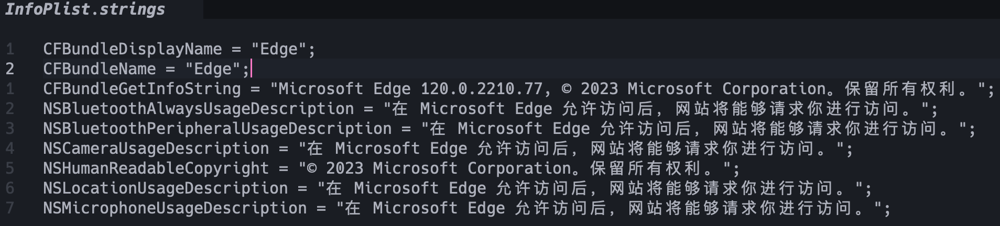

# Mac 自定义 Edge 在菜单栏中的名称

## 背景

14寸的 MacBook Pro 在使用 Edge 的时候，菜单栏占的位置贼多，像下面这样


中间是刘海，右侧空间直接被挤没了，我可怜的菜单栏

## 解决方法

1. ~~自定义 Edge 的菜单栏（ Edge 还不支持）。~~
2. 修改苹果 logo 旁的 app 名称，减少字数以减少占用面积

## 具体步骤

进入 zh_CN.lproj 目录

```zsh
cd /Applications/Microsoft Edge.app/Contents/Resources/zh_CN.lproj
```

编辑目录下的 InfoPlist.strings，增加下面两行配置

```strings
CFBundleDisplayName = "Edge";
CFBundleName = "Edge";
```

就像这样：



保存后重启 Edge。

## 效果


刚刚好，都在刘海儿左侧了。

## 延伸

理论上所有 app 都支持这样自定义，修改 Resources 目录下或者Resources 目录下多语言配置的子目录下的 InfoPlist.strings 即可，如果没有则新建一个。
