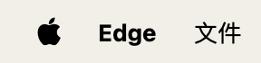
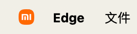

# Mac 应用推荐

## Homebrew

> [Homebrew — The Missing Package Manager for macOS (or Linux)](https://brew.sh/)

brew 是 Mac 下的包管理器，Mac 必备。

## QLMarkdown

> [sbarex/QLMarkdown: macOS Quick Look extension for Markdown files. (github.com)](https://github.com/sbarex/QLMarkdown)

Mac 的空格预览很方便，但是不支持 Markdown文件，安装 QLMarkdown 可以使用空格预览 Markdown 文件。

## Syntax Highlight

> [sbarex/SourceCodeSyntaxHighlight: Quick Look extension for highlight source code files on macOS 10.15 and later. (github.com)](https://github.com/sbarex/SourceCodeSyntaxHighlight)

QLMarkdown 作者的另一个预览插件，这个插件主要是预览时可以实现语法高亮。

## Input Source Pro

> [Input Source Pro - Switch and track your input sources with ease](https://inputsource.pro/)

自动切换输入法，可以设置成在 IDE 中切换成英文输入法，在微信等软件中切换成中文输入法，极大减少输入法切换次数。

## Maccy

> [p0deje/Maccy: Lightweight clipboard manager for macOS (github.com)](https://github.com/p0deje/Maccy)

剪切板工具，可以保存复制历史。

## Snipaste

> [Snipaste](https://www.snipaste.com/)

截图贴图工具，支持多平台，之前在 Windows 上就一直在用。

## QuickRecorder

> [lihaoyun6/QuickRecorder: A lightweight screen recorder based on ScreenCapture Kit for macOS / 基于 ScreenCapture Kit 的轻量化多功能 macOS 录屏工具 (github.com)](https://github.com/lihaoyun6/QuickRecorder)

Mac 的录屏工具，Swift 原生开发的，体积很小，适用于简单的录屏。

## Logoer

> [lihaoyun6/Logoer: Change the style of the Apple logo in macOS menu bar / 更换macOS菜单栏苹果Logo样式的小工具 (github.com)](https://github.com/lihaoyun6/Logoer)

QuickRecorder 作者的另外一个有趣的软件，可以把左上角的苹果 logo 进行替换（实际上是贴了个图，把苹果 logo 盖住了），很有意思。

## 未完待续

