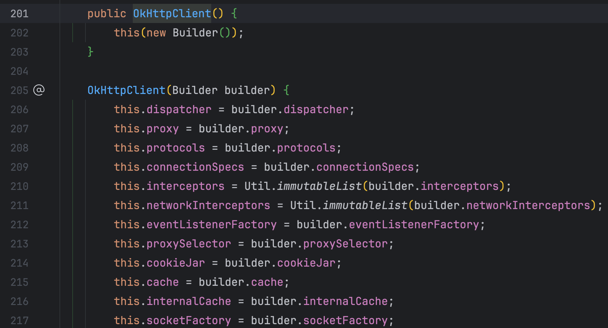

# 一次解决JVM线程数量过高问题的经历

## 现象

最近断断续续会收到一个服务的告警，警告 JVM thread 使用量过高，打开 Grafana 一看，好家伙，波澜起伏：


万幸线程数不是一直上涨，不然服务就崩了。

## 排查

看图表的几个峰顶的时间，应该和白天每两个小时获取一次录音的定时任务有关。线程数高肯定是有地方频繁的创建了线程，看了一下相关的代码，也没有创建线程的地方，甚至都没有创建线程池的地方，很奇怪。

## 分析

代码看不出问题，就得上工具了，本地把项目跑起来，使用 JProfiler 查看项目的线程变化，定时任务触发后线程数持续上涨：


查看线程历史，可以看到 OkHttp ConnectionPool 很多：


使用 jstack 生成线程的堆栈信息：

```shell
jstack [pid] > thread-stack.dump
```

然后使用[fastthread](https://fastthread.io/)进行分析：


可以看到就是 OkHttp ConnectionPool 的问题。

## 定位

看到名字就知道和 OkHttpClient 有关系了，这个服务里只有一个地方用到了 OkHttpClient，是一个工具类，使用 head 请求用来判断一个 URL 是否是一个录音文件，代码如下：

```java
@Slf4j
public class HttpUtils {

    public static final String CONTENT_TYPE = "Content-Type";
    public static final String CONTENT_DISPOSITION = "Content-Disposition";
    public static final String AUDIO_WAV = "audio/wav";
    public static final String OCTET_STREAM = "application/octet-stream";
    public static final String ATTACHMENT = "attachment";
    public static final String NULL_STR = "null";


    /**
     * 判断是否是音频文件
     *
     * @param url 音频文件地址
     * @return true 是音频文件, false 不是音频文件
     */
    public static boolean isAudio(String url) {
        if (StringUtils.isEmpty(url)) {
            return false;
        }
        Request request = new Request.Builder().url(url).head().build();
        OkHttpClient client = new OkHttpClient();
        try (Response response = client.newCall(request).execute()) {
            if (!response.isSuccessful()) {
                return false;
            }
            Headers headers = response.headers();
            String contentType = headers.get(CONTENT_TYPE);
            String contentDisposition = headers.get(CONTENT_DISPOSITION);
            return Objects.equals(contentType, AUDIO_WAV) ||
                Objects.equals(contentType, OCTET_STREAM) ||
                (Objects.nonNull(contentDisposition) &&
                    contentDisposition.contains(ATTACHMENT)
                    && !contentDisposition.contains(NULL_STR));
        } catch (Exception exception) {
            log.error("Error checking if URL is audio: {}", url, exception);
            return false;
        }
    }
}
```

看 OkHttp ConnectionPool 的名字，应该是 OkHttpClient 里面的连接池，点进 OkHttpClient 源码里面看一下



可以看到 OkHttpClient 的默认构造函数里面调用了另外一个构造函数，参数多了一个 builder，点进 Builder 类里面看一下：


发现了 connectionPool，再点进 ConnectionPool 的源码里面看一下：


可以看到，最大5个连接，最多空闲5分钟，到这里也就明白了为什么线程数为什么涨那么多后来又降下来了，因为每次判断都会实例化一下 OkHttp 的连接池，导致线程数不断的升高，又因为有5分钟的时间限制，所以后面线程数会慢慢降下来。

## 解决

知道问题出在哪儿，解决起来就简单了，因为 OkHttpClient 是线程安全的，所以我们实例化一个静态的 client 就行，优化后的代码如下：

```java
@Slf4j
public class HttpUtils {

    public static final String CONTENT_TYPE = "Content-Type";
    public static final String CONTENT_DISPOSITION = "Content-Disposition";
    public static final String AUDIO_WAV = "audio/wav";
    public static final String OCTET_STREAM = "application/octet-stream";
    public static final String ATTACHMENT = "attachment";
    public static final String NULL_STR = "null";

    public static final OkHttpClient client = new OkHttpClient.Builder()
        .connectTimeout(10, TimeUnit.SECONDS)
        .readTimeout(10, TimeUnit.SECONDS)
        .build();


    /**
     * 判断是否是音频文件
     *
     * @param url 音频文件地址
     * @return true 是音频文件, false 不是音频文件
     */
    public static boolean isAudio(String url) {
        if (StringUtils.isEmpty(url)) {
            return false;
        }
        Request request = new Request.Builder().url(url).head().build();
        try (Response response = client.newCall(request).execute()) {
            if (!response.isSuccessful()) {
                return false;
            }
            Headers headers = response.headers();
            String contentType = headers.get(CONTENT_TYPE);
            String contentDisposition = headers.get(CONTENT_DISPOSITION);
            return Objects.equals(contentType, AUDIO_WAV) ||
                Objects.equals(contentType, OCTET_STREAM) ||
                (Objects.nonNull(contentDisposition) &&
                    contentDisposition.contains(ATTACHMENT)
                    && !contentDisposition.contains(NULL_STR));
        } catch (Exception exception) {
            log.error("Error checking if URL is audio: {}", url, exception);
            return false;
        }
    }
}
```

代码上线之后再看线程的监控就很正常了


## 反思

1. 线程数很高是很不正常的情况，收到告警应该及时的去解决。
2. 使用别人的库的时候要注意，尽可能使用单例模式。
